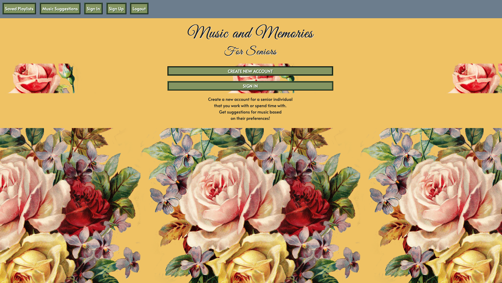
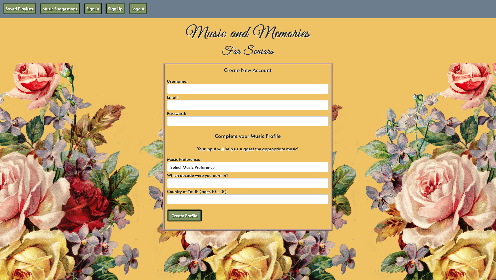
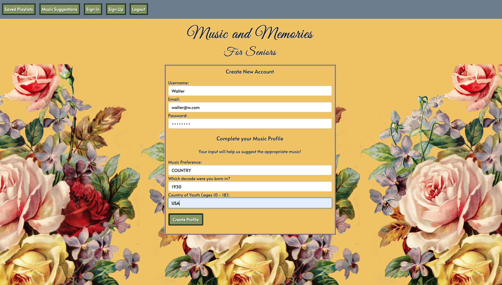
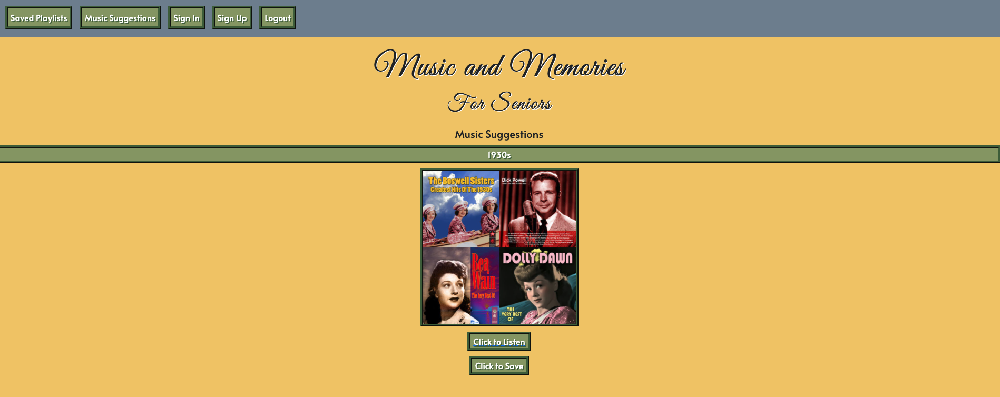
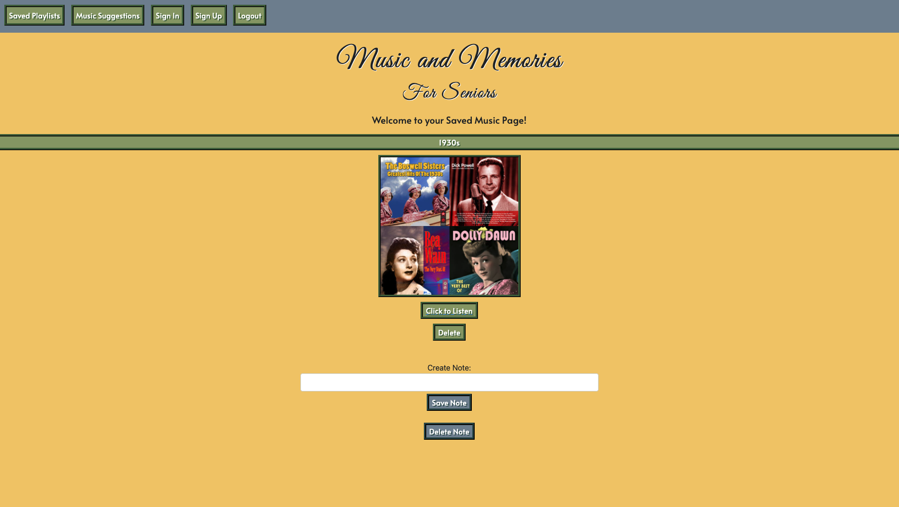

# **MUSIC AND MEMORIES (FOR SENIORS)**

## Inspiration

In my previous career, I worked as a music therapist with seniors in long term care facilities, many of whom were living with dementia. It can be difficult to connect with someone living with dementia but when I would sing or play one of their favourite songs, the seniors were often able to remember the words and sing along as well as recall and share memories related to the songs.

## General Overview

"Music and Memories (For Seniors)" is a tool for people who spend time with or work with seniors. The app uses a Spotify API and suggests music by the senior's music preferences and the decade they were born in.

The user is then able to save playlists onto their "Saved Music" page. Once a playlist is there they are able to create a note, and delete it.

## Data Entities

The main functional idea of the app is that each unique user has a M:M relationship with their suggested playlists based on what they input when they create their account.

The second data entity is the 1:M relationship between the user's suggested music and the playlists they choose as their favourites. The favourites are then saved on the user's 'Saved Music' page which is unique to each user. The user's favourites is a schema that is embedded within the user schema.

## Special Conditions

Only if a user has an account and they are logged in, can they access the music suggestions page and save music to their "Saved Music" Page.

## Screenshots

- The home page - A description of the app is displayed as well as a navigation bar with options to sign up or sign in. Only users with an account can access the "Saved Music" and "Music Suggestions" pages located in the nav bar.
  

- Once the user clicks the "create new account" button they are redirected to the page below:
  

- The user then inputs all the necessary information regarding the senior they are spending time with or working with:
  

- The user is redirected to the "Music Suggestions" page. The app uses the Spotify API to generate playlists based upon what the user input for the senior's music preferences and decade they were born in. 

- The user can then click the 'click to save' button in order to save specific playlists to their "Saved Music Page." The user will immediately be redirected to the "Saved Music Page" once they click the 'click to save' button. However, they can return to the Music Suggestions page by clicking the "Music Suggestions" button in the nav bar. 

- The user can add a note to each playlist by clicking "create note" and adding input into the field.
  

- The user can delete their note from each playlist by clicking "delete note" and it will disappear from the screen.
  

- The user can delete the entire playlist from their "Saved Music" page by clicking the "delete" button situated underneath the playlists and it will disappear from the screen.
  

## Technologies Used

- Spotify API
- Node.js
- Express
- MongoDB

## Future Work

- Allow one user to have many different profiles
- Allow users to set their 'Saved Music Pages' to private or public
- Allow users to
- Allow users to browse other users profiles
